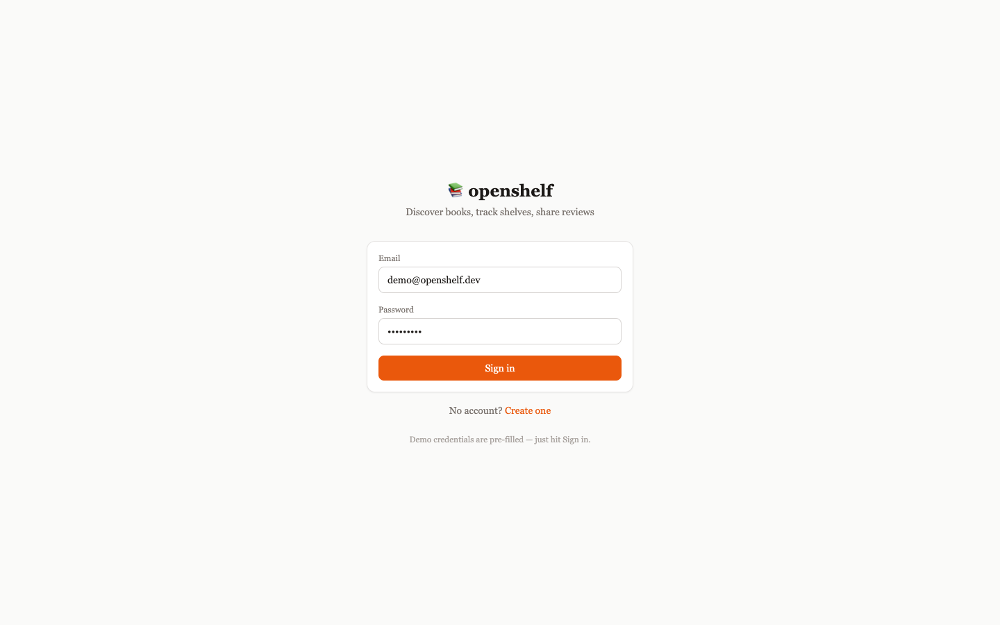
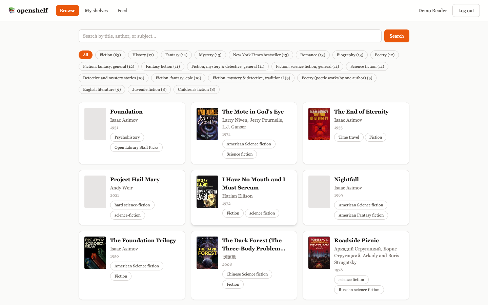
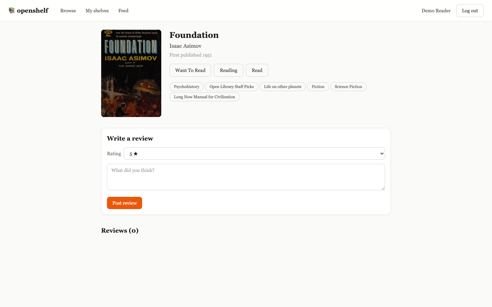
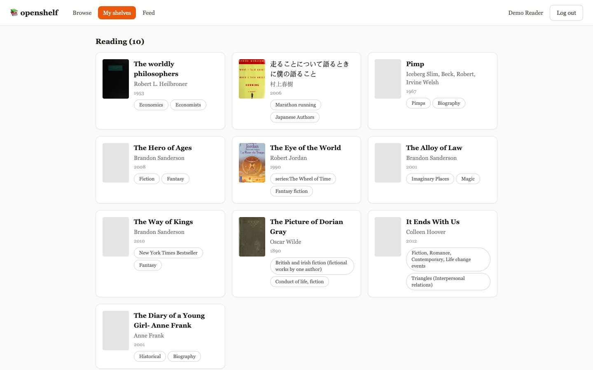
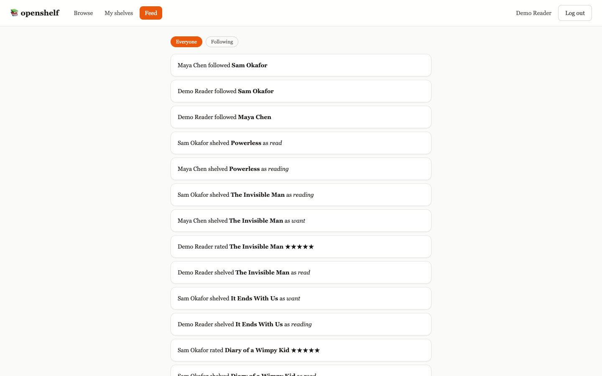
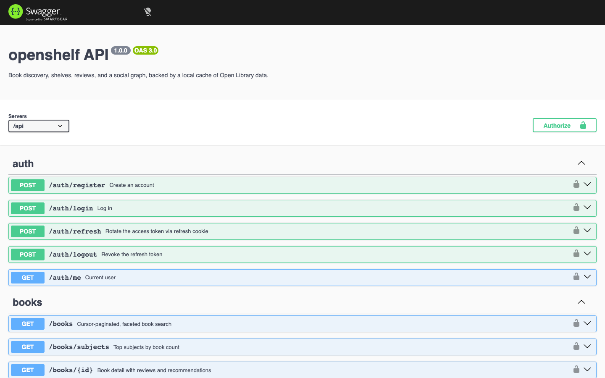
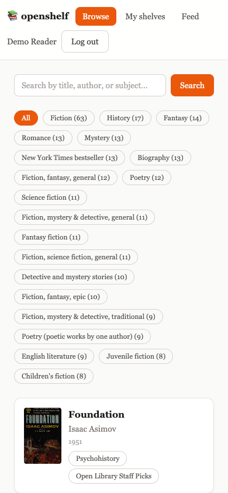

# 📚 openshelf

**Book discovery, shelves, reviews, and a social graph.** MERN full-stack portfolio project —
faceted full-text search with cursor pagination, MongoDB aggregation-pipeline recommendations, a
follow graph with an activity feed, avatar uploads, and a published OpenAPI spec.


The catalog is real: 117 books imported from the [Open Library](https://openlibrary.org/) public
API (captured as committed fixtures — see [`docs/DECISIONS.md`](docs/DECISIONS.md) for why), with
real covers, authors, and subjects. Every screenshot below was captured against the running app.

## Screenshots

| Login | Browse & search |
|---|---|
|  |  |

| Book detail | My shelves |
|---|---|
|  |  |

| Activity feed | API docs (Swagger) |
|---|---|
|  |  |

| Mobile |
|---|
|  |

## Features

- **Auth**: JWT access token (in memory) + refresh token (`httpOnly` cookie, rotated on refresh),
  same pattern as the pulseboard repo
- **Search**: full-text search (title/author/subject) over a MongoDB text index, combined with
  subject and publish-year facets, paginated with an `_id`-based cursor (not offset/skip)
- **Shelves**: want-to-read / reading / read, one entry per (user, book), moving shelves upserts
  rather than duplicating — with optimistic UI updates via TanStack Query
- **Reviews**: one review per user per book (re-reviewing edits in place), ownership enforced at
  the query level so you can never delete or see edit controls for someone else's review
- **Recommendations**: "readers also shelved" computed live via a MongoDB aggregation pipeline —
  no precomputed table, no external ML service
- **Social graph**: follow/unfollow, follower/following lists, public profiles
- **Activity feed**: global or following-only, covering shelving, reviewing, and following events
- **Avatar uploads**: `multer`-backed multipart upload with type/size validation
- **API docs**: a full OpenAPI 3.0 spec served at `/api/docs` via Swagger UI

## Stack

Express 4 · Mongoose 8 · Zod · JWT · bcrypt · multer · swagger-ui-express — React 18 · Vite ·
React Router · TanStack Query · Tailwind CSS · Axios

## Architecture

See [`docs/ARCHITECTURE.md`](docs/ARCHITECTURE.md) for the request-flow diagram and
[`docs/DECISIONS.md`](docs/DECISIONS.md) for the reasoning behind cursor pagination, the
live-aggregation recommender, and the denormalized activity feed.

## API

Full interactive docs at `/api/docs` once running. Summary:

| Method | Route | Auth | Description |
|---|---|---|---|
| POST | `/api/auth/register` \| `/login` \| `/refresh` \| `/logout` | mixed | Auth lifecycle |
| GET | `/api/auth/me` | user | Current user |
| GET | `/api/books` | user | Faceted, cursor-paginated search |
| GET | `/api/books/subjects` | user | Top subjects by book count |
| GET | `/api/books/:id` | user | Detail + reviews + recommendations + your shelf status |
| GET/POST/DELETE | `/api/shelf` | user | Manage your shelves |
| POST/DELETE | `/api/reviews` | user | Create/update/delete your review |
| GET | `/api/users/:id` | user | Public profile + follow counts |
| POST | `/api/users/me/avatar` | user | Upload an avatar |
| POST/DELETE | `/api/users/:userId/follow` | user | Follow / unfollow |
| GET | `/api/activity/feed` | user | Global or following-scoped feed |

## Getting started

Requires Node 22 (see `.nvmrc`) and Docker.

```bash
nvm use
npm install                      # installs both workspaces (server + client)

docker compose up -d             # Mongo on host port 27018 (kept off 27017 so this can run
                                  # alongside pulseboard's own Mongo container)
npm run seed                     # imports the committed Open Library fixtures

npm run dev                      # API on :4002, client on :5175
```

Demo credentials (also pre-filled on the login page):

| User | Email | Password |
|---|---|---|
| Demo Reader | `demo@openshelf.dev` | `Demo1234!` |
| Maya Chen | `maya@openshelf.dev` | `Demo1234!` |
| Sam Okafor | `sam@openshelf.dev` | `Demo1234!` |
| Admin | `admin@openshelf.dev` | `Admin123!` |

Demo Reader already follows Maya and Sam, and has books shelved across all three statuses with a
few reviews — the feed and recommendations pages aren't empty on first login.

## Testing

```bash
docker compose up -d && npm run seed   # integration + e2e both need Mongo up and seeded

npm run test:unit          # Jest — pure logic (fixture import/dedup, JWT signing)
npm run test:integration   # Jest + Supertest against the Docker Mongo, throwaway DB per suite
npm run test:e2e           # Playwright — auto-starts the API + client dev servers if not running
npm test                   # runs all three, in that order
```

25 tests total: 5 unit, 12 integration, 8 end-to-end.

## Regenerating screenshots

With the stack running and seeded:

```bash
npm run screenshots
```

## Project structure

```
openshelf/
├── server/          Express API, Mongoose models, OpenAPI spec, tests
├── client/          React + Vite + TanStack Query frontend
├── e2e/             Playwright end-to-end specs
├── scripts/         screenshots.mjs
├── docs/            architecture, decisions, screenshots
└── docker-compose.yml
```
