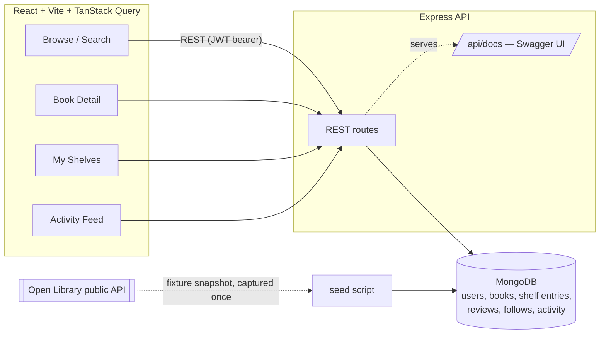

# Architecture

## Why the catalog isn't fetched live

Open Library data is imported **once**, at seed time, from committed fixture files
(`server/src/seed/fixtures/search_*.json` — real API responses, one per genre) into a local
`Book` collection. Every search, filter, and recommendation query in the running app hits MongoDB,
never Open Library directly. See [`DECISIONS.md`](./DECISIONS.md) for why.

## Request flow

1. Auth mirrors the pattern in the pulseboard repo: JWT access token in memory, refresh token in
   an `httpOnly` cookie scoped to `/api/auth`, rotated on every refresh, revocable via a
   `refreshTokenVersion` counter on the user document.
2. **Search** (`GET /api/books`) combines a MongoDB `$text` index (title/author/subject) with
   facet filters (`subject`, `year`) and a cursor (`_id`-based, not offset) for pagination.
3. **Book detail** (`GET /api/books/:id`) fans out three queries in parallel: the book's reviews,
   its "readers also shelved" recommendations (an aggregation pipeline — see below), and the
   current user's own shelf status for that book, which is what makes the shelf buttons on the
   client show the right state.
4. **Recommendations** are computed live via `bookService.recommendationsFor()`: find everyone who
   shelved this book, then find every *other* book those same people shelved, grouped and ranked by
   co-occurrence count — a single `ShelfEntry.aggregate([...])` pipeline, no precomputed table.
5. **Activity feed** reads from a denormalized `Activity` collection written by the shelf, review,
   and follow controllers — a fan-out-on-write to one collection rather than to every follower's
   inbox, which is the right tradeoff at this scale (see DECISIONS.md).
6. **Avatars** are uploaded via `multer` to local disk (`server/uploads/`, gitignored) and served
   back statically at `/uploads/:filename`.

## Ownership and authorization

Every mutation that should be scoped to "your own data" — deleting a review, removing a shelf
entry — is enforced by including `user: req.user._id` directly in the MongoDB query itself
(`Review.findOneAndDelete({ _id, user: req.user._id })`), not by fetching the document first and
comparing an owner field in application code. A request for someone else's review ID returns 404,
not 403 — the query simply finds nothing, which also avoids leaking whether the ID exists at all.
